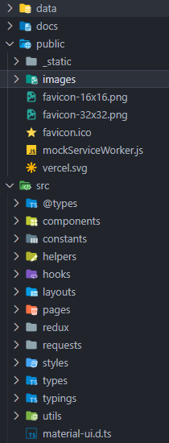
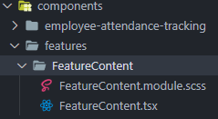
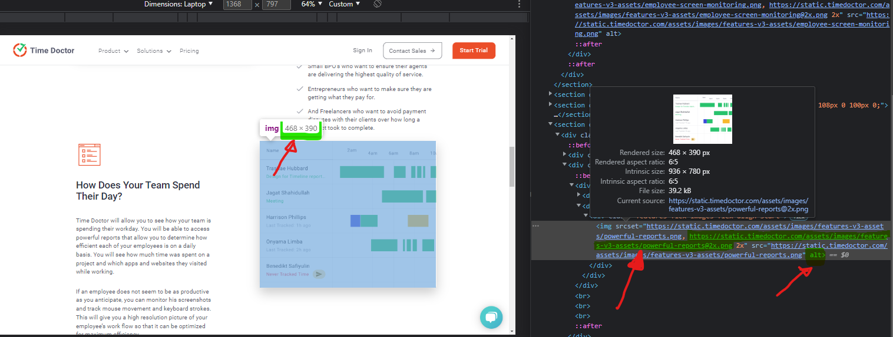

# RULES

- pixel-perfect можуть допускатися невеликі відступи на зразок 1-2px різниці, але потрібно мінімалізувати їх кількість
- index.(js|ts|jsx|tsx) - заборонено використовувати. Вони не хочуть спрощенні посилання для точності використання.
- Старі файли .tsx/.ts можна редагувати мінімально. `(Перед початком роботи з ними відімкнути autoformat!)`
- Файли в styles не можна редагувати. (Окрім своїх)

# Structure



- public/images
    > Всі зображення в проєкті
- data
    > Зберігає `.json` файли з текстом та даними для зображень.
- ### src
  - components
    > Компоненти які будуть повторно використовуватися
  - constants
    > Всі глобальні константи
  - layouts
    > Layout який буде використовуватися між декількома сторінками
  - pages
    > Всі сторінки. Більше деталей як це працює [тут](https://nextjs.org/docs/basic-features/pages)
  - styles
    > Якщо сторінка потребує додаткову стилізацію, то тут вони зберігаються.
  - types
    > Всі глобальні типи

# Naming



`component/`

`features` [page name] <- kebab-case

`FeatureContent`[component folder name] <- UpperCamelCase

`FeatureContent.tsx`[component name] <- UpperCamelCase

# Migration

Припустимо що назва нашої сторінки `darly-solutions`

1. Створюємо `darly-solutions.json` в `data/`
2. Створюємо `darly-solutions.constants.ts` в `constants/`
3. Створюємо `darly-solutions.tsx` в `pages/`
4. Створюємо папку `darly-solutions` в `public/images/`

## `darly-solutions.json`

> В цьому файлі ми будемо зберігати всю інформацію про текст та зображення на сторінці.

### Обов'язкова інформація в файлі.

Потрібно для SEO.

```json
{
  "title": "",
  "desc": "",
  "keywords": ""
}
```

### Структура

Немає жодних правил. Можна організовувати під себе. Орієнтуйся на логіку та оптимізацію.

### Робота з зображеннями



Кожне зображення вимагає ці поля

```json
{
  "image": {
    "src": "/images/darly-solutions/image.png",
    "alt": "",
    "width": 468,
    "height": 390
  }
}
```

Зображення звантажувати з сайту скопіювавши посилання на нього і перейшовши по посиланню.

Переносимо точні розміри зображення при розмірах `browser` від `1250px`.

## `darly-solutions.constants.ts`

> За допомогою цього файлу бдевиконуватися типізація JSON та використааня тексту в проекті а також параметрів зображень.

### Структура

```ts
import JSON from 'data/darly-solutions.json';

export const DarlySolutions = JSON as Data;

interface Data extends FeaturePageJsonBaseStructure {
  // All data
}
```

## darly-solutions.tsx

```tsx
import { DarlySolutions } from '@/constants/darly-solutions.constants';
import { FeaturesLayout } from '@/layouts/FeaturesLayout/FeaturesLayout';

const { desc, keywords, title } = DarlySolutions;

// You will found this information about this inside task card
const HOME_CTA = 'darly-solutions';

// FeaturesLayout - Universal Layout what use in many pages. Have footer and top-navigation

const Page = () => (
  <FeaturesLayout
    homeCta={HOME_CTA}
    pageDesc={desc}
    pageTitle={title}
    keywords={keywords}
  >
    {/* All element */} 
  </FeaturesLayout>
);

export default Page;
```

## СТИЛІ

### Проєкт мігрує з Bootstrap 3 в Bootstrap 5. Можна мігрувати дизайн ігноруючі Bootstrap, але це буде вимагати багато часу.

Необхідно прочитати

[Help link](https://www.webdevsplanet.com/post/bootstrap-col-xs-*-not-working)

[Help link](https://www.webdevsplanet.com/post/bootstrap-col-md-offset-not-working)

#### Основні проблеми міграції

**col**

- col-xs-\* -> col-\*
- col-md-\* -> col-lg-\*
- col-lg-\* -> col-xl-\*

**offset**

- col-md-offset-\* -> offset-lg-\*

**Removed class**

- col-push-\*, col-pull-\* були видаленні та потребують перероблювання.
